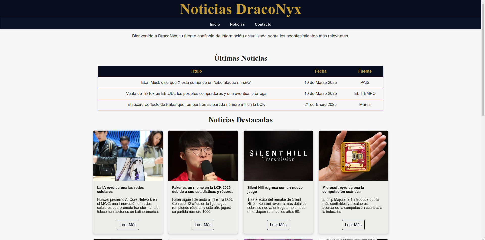

# 📰 DracoNyx - Página de Noticias




DracoNyx es un proyecto web que muestra las últimas noticias sobre tecnología, videojuegos y eventos relevantes. 🎮💻 El diseño está inspirado en la estética de League of Legends, con colores vibrantes y un estilo moderno. 🎨✨

## 🚀 Características

## 🚀 Características  

- ✅ **Diseño responsivo**: Adaptado para dispositivos móviles, tablets y desktop. 📱💻🔦  
- ✅ **Barra de navegación**: Secciones de Inicio, Noticias y Contacto. 🫣  
- ✅ **Tablas de noticias**: Últimas noticias con fecha y fuente. 📅📰  
- ✅ **Noticias destacadas**: Tarjetas con enlaces a las fuentes originales. 🔗✨  
- ✅ **Organización modular**: Código CSS separado en archivos independientes para facilitar el mantenimiento. 📂  


## 🛠️ Tecnologías utilizadas

HTML5: Para la estructura del sitio. 🏗️

CSS3: Para los estilos y diseño responsivo. 🎨

📁 Estructura del Proyecto

```bash
Mi_pagina_Noticias/
│
├── CSS/
│   └── style.css  # Archivo de estilos principal
│
├── img/           # Carpeta para imágenes (si las tienes)
│
├── index.html     # Página principal del proyecto
│
└── README.md      # Documentación del proyecto
```

## 🖥️ Instalación y Uso

Clona el repositorio en tu máquina local 🖥️📥

```bash
git clone https://github.com/LeXScripterX/Proyecto-Primer-Corte-Mi-P-gina-de-Noticias-Favoritas-.git
```

Navega a la carpeta del proyecto 📂

cd Mi_pagina_Noticias

Abre el archivo index.html en tu navegador 🌐

Windows: Doble clic en index.html

Mac/Linux: Ejecuta en terminal:

```bash
open index.html  # macOS
xdg-open index.html  # Linux
```

📌 Explicación de la organización del código

📌 CSS modular: Código separado en la carpeta css/ para facilitar mantenimiento y actualización.

📌 Estructura limpia: Imágenes almacenadas en img/ para mantener ordenado el directorio principal.

📌 HTML semántico: Uso de etiquetas semánticas para mejorar accesibilidad y SEO. 🔍

## 🎓 Lo que aprendí

- 💡 La importancia de estructurar el código de manera eficiente.
- 💡 Aplicar buenas prácticas de desarrollo web.
- 💡 Diseñar interfaces atractivas y funcionales.
- 💡 Mejorar habilidades en HTML y CSS, asegurando diseño responsivo y accesible.

### 🎨 Colores y Diseño

🎨 Los colores utilizados están inspirados en la estética de League of Legends. Se combinaron tonos oscuros y dorados con detalles luminosos para transmitir una experiencia visual vibrante y dinámica. ⚡🌟

![[


### 🤝 Contribuciones

Este proyecto fue desarrollado por LeXScripterX.
### 📜 Licencia

Este proyecto está licenciado bajo la GNU General Public License v3.0. 📝

📌 GPLv3 License - Puedes ver más detalles en GNU GPLv3.
